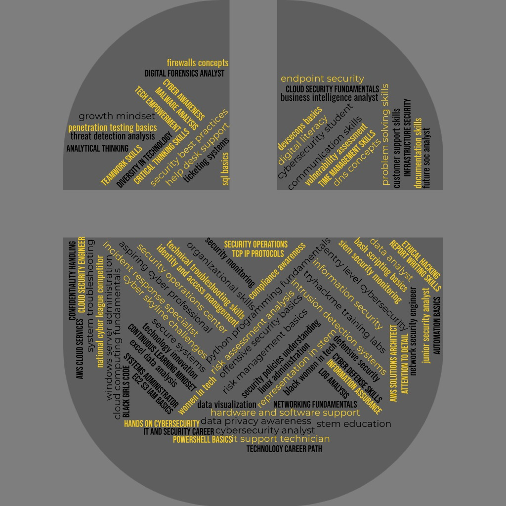

# 🔐 Adriana Daniels Cybersecurity Portfolio

## 🚀 Aspiring SOC Analyst | Cloud Security | Data-Driven Cybersecurity

> “My goal is to detect, analyze, and respond to security threats while building strong expertise in cybersecurity operations, cloud infrastructure, and security analytics.”

---

## 👩🏽‍💻 Professional Summary

Aspiring cybersecurity and IT professional focused on security operations, threat analysis, and cloud fundamentals. I bring strong analytical problem-solving skills and hands-on experience through cybersecurity labs, technical training platforms, and simulated enterprise environments.

Currently transitioning into cybersecurity from a background in healthcare-related sciences and IT systems, with a focus on applying security principles in real-world environments. Known for strong communication, documentation, and troubleshooting abilities developed through both academic and operational roles.

Actively seeking entry-level SOC Analyst, Cybersecurity Analyst, or IT support roles where I can contribute to security operations and continue growing in enterprise environments.

---

## 🎓 Education

- Bachelor of Science in Exercise Science — Lamar University  
- Associate of Applied Science (AAS), Computer Systems Networking (Cybersecurity Specialization) — Houston City College  
  - Class Rank: Sophomore

---

## 🧠 Technical Skills

- Cybersecurity fundamentals (networking, threats, defense concepts)
- Active Directory & access control concepts
- Linux system administration and command-line usage
- AWS fundamentals (EC2, S3, IAM)
- Security monitoring and log analysis concepts (SIEM basics)
- Python and Excel for data analysis
- IT troubleshooting and technical support
- Technical documentation and incident reporting

---

## 🎯 Career Objectives

### Target Roles
- Security Operations Center (SOC) Analyst  
- Cybersecurity Analyst  
- Systems Administrator  
- Network Security Engineer  
- Cloud Operations Engineer  
- Data / Security Analyst  

### Focus Areas
- Threat detection and incident response  
- Identity and access management (IAM)  
- Network traffic analysis and monitoring  
- Security log analysis (SIEM fundamentals)  
- Windows & Linux system administration  
- Cloud security fundamentals (AWS/Azure concepts)  

---

## 🏅 Organizations & Training Platforms

- Houston City College Cybersecurity Program (AAS Track)  
- National Cyber League (NCL Cyber Skyline Participant)  
- Cisco Networking Academy (NetAcad Student)  
- NDG NetLab+ Virtual Lab Training  
- TryHackMe Cybersecurity Training Platform  

---

## 🧪 Cybersecurity Competitions & Training

- XP Cyber Range (NICE Challenge Project)  
- National Cyber League (Cyber Skyline)  
- TryHackMe Labs  
- Cisco Networking Academy Labs  
- NDG NetLab+ Linux & Networking Simulations  

---

## 📂 Projects & Hands-On Work

### 🔐 XP Cyber Range Security Investigations

🔗 https://github.com/adrianad-tech/XpCyberRangeProjects

- Investigated security incidents in simulated enterprise environments  
- Analyzed logs, system behavior, and network activity to identify threats  
- Documented structured incident reports with findings and remediation steps  
- Applied SOC-style workflows including troubleshooting and escalation logic  

---

## 💼 Experience

### Rec Sports – University Recreation Department

- Completed internship in operations and administrative support  
- Continued part-time employment post-internship  
- Developed communication, organization, and teamwork skills  
- Managed documentation, scheduling, and operational processes with accuracy  
- Strengthened problem-solving and user support abilities in fast-paced environments  

---

## 🌟 Role Model & Inspiration

Kimberly Bryant — Founder of Black Girls Code

> “We have to make sure that girls know that they can code, that they belong in tech, and that they can build the future.”

Her work in expanding access to technology education inspires my commitment to building a career in cybersecurity and contributing to a more inclusive and secure technology industry.

---

## 📫 Contact

- LinkedIn: https://www.linkedin.com/in/adriana-daniels-b920a2347/  
- Email: adaniels926@yahoo.com  
- GitHub: https://github.com/adrianad-tech  

---

## 📄 Resume

[Download My Resume](https://github.com/adrianad-tech/adriana-resume/blob/main/Adriana_Daniels_Cybersecurity_Resume.pdf)

---

## 📊 Skills Snapshot

